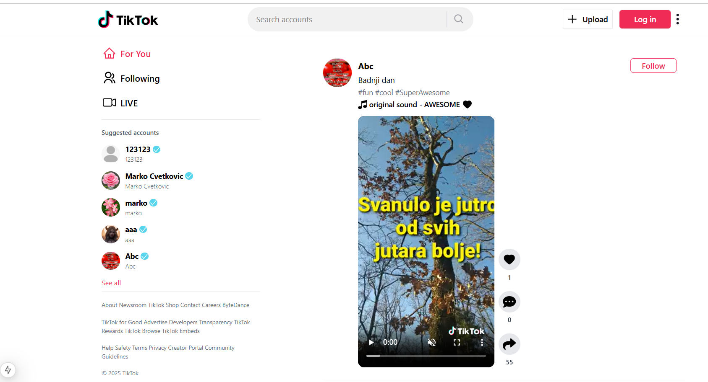
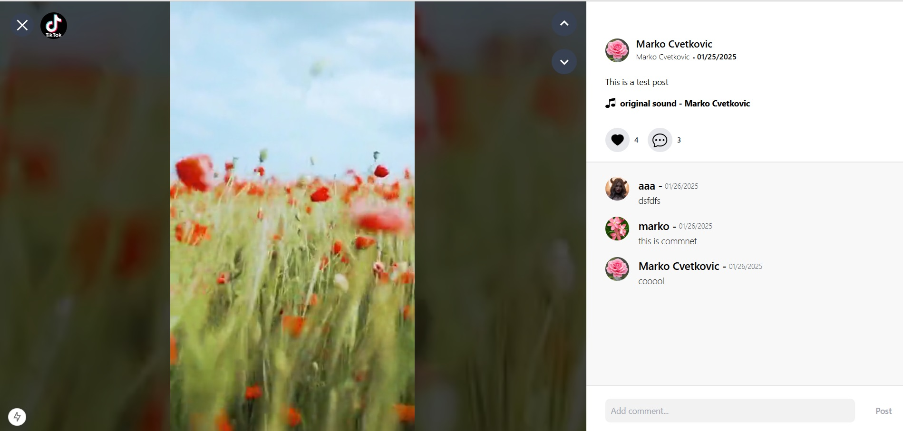
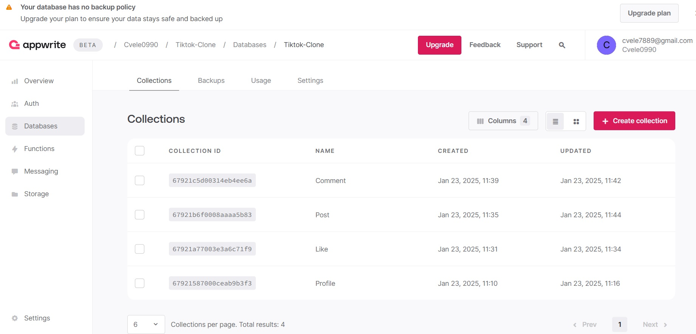

# 🎵 TikTok Clone

Ovo je klon popularne aplikacije TikTok napravljen korišćenjem modernih web tehnologija. Aplikacija omogućava korisnicima da postavljaju video sadržaje, lajkuju i komentarišu objave, kao i da pregledaju tuđe postove u stilu poznate "For You" stranice.

---

## 🚀 Tehnologije koje su korišćene

- **React** – Frontend biblioteka za izradu korisničkog interfejsa.
- **Next.js** – React framework za izgradnju modernih web aplikacija sa podrškom za server-side rendering i routing.
- **TypeScript** – Superset JavaScript-a koji omogućava statičku tipizaciju radi bolje stabilnosti i skalabilnosti koda.
- **Zustand** – Lagana state management biblioteka zasnovana na hookovima.
- **Appwrite** – Backend kao servis, koristi se za:
  - autentifikaciju korisnika
  - čuvanje postova, komentara, lajkova i profila
  - cloud funkcionalnosti i baze podataka
- **Tailwind CSS** – CSS framework za brzo stilizovanje korisničkog interfejsa.
- **React Router** – Navigacija unutar aplikacije _(može biti zamenjen Next.js router-om)_.
- **TikTok-style Video Player** – Custom video plejer koji emulira funkcionalnosti TikTok-a.

---

## 📱 Funkcionalnosti

- ✅ Registracija i prijava korisnika (koristeći Appwrite auth)
- ✅ Postavljanje video sadržaja
- ✅ Pregled videa (For You feed)
- ✅ Like / Unlike sistem
- ✅ Komentarisanje postova
- ✅ Prikaz korisničkog profila i lista svih objava
- ✅ Backend struktura podeljena u kolekcije: `Post`, `Comment`, `Like`, `Profile`

---

## 🧱 Struktura baze (Appwrite)

Baza podataka koristi sledeće kolekcije:

1. `Post` – čuva informacije o svakom postu (video, opis, korisnik itd.)
2. `Comment` – čuva komentare povezane sa postovima
3. `Like` – evidentira koji korisnik je lajkovao koji post
4. `Profile` – dodatne informacije o korisniku

## ⚙️ Pokretanje aplikacije

1. Kloniraj repozitorijum:

   git clone https://github.com/your-username/tiktok-clone.git
   cd tiktok-clone

2. Instaliraj zavisnosti:

npm install

3. Popuni .env fajl sa Appwrite konfiguracijom (primer ispod)

4. Pokreni aplikaciju u development modu:

npm run dev

5. Za build produkcijske verzije aplikacije:

npm run build
npm run start

## 📸 Screenshotovi aplikacije

### 🖼️ 1. Početni prikaz feed-a

  
_Primer feed-a sa objavom, opisom i brojem lajkova, komentara i šerova._

---

### 🖼️ 2. Prikaz komentara ispod objave

  
_Komentari ispod objave uz mogućnost dodavanja novih._

---

### 🖼️ 3. Appwrite struktura baze

  
_Appwrite prikaz kolekcija koje se koriste za rad aplikacije._

---

## ⚙️ Konfiguracija Appwrite okruženja

1. **Kreiraj Appwrite nalog i projekat**
2. **Dodaj Web platformu** (npr. `http://localhost:5173` za lokalni razvoj)
3. **Kreiraj sledeće kolekcije**:

   - `Post` – sa poljima: video URL, caption, userID, timestamp
   - `Comment` – sa poljima: content, userID, postID, timestamp
   - `Like` – sa poljima: userID, postID
   - `Profile` – sa poljima: username, avatar URL, bio

4. **Omogući File Storage** za upload videa
5. **Kreiraj API key sa odgovarajućim permisijama**

---

## 🗂️ .env primer

```env
VITE_APPWRITE_ENDPOINT=https://cloud.appwrite.io/v1
VITE_APPWRITE_PROJECT_ID=your_project_id
VITE_APPWRITE_DATABASE_ID=your_database_id
VITE_APPWRITE_BUCKET_ID=your_bucket_id
VITE_APPWRITE_API_KEY=your_api_key
```
